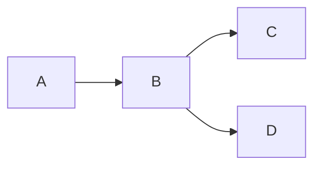
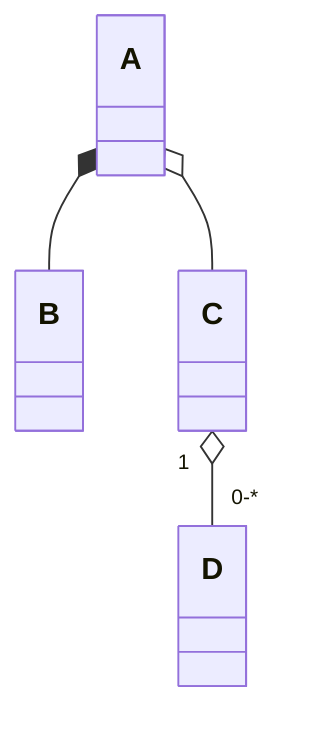
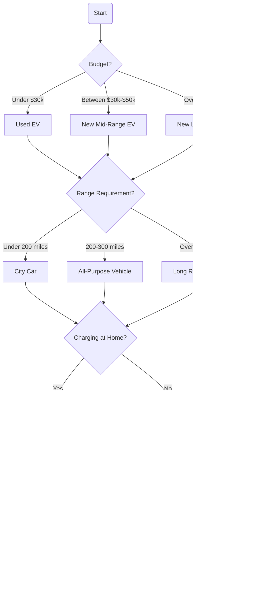
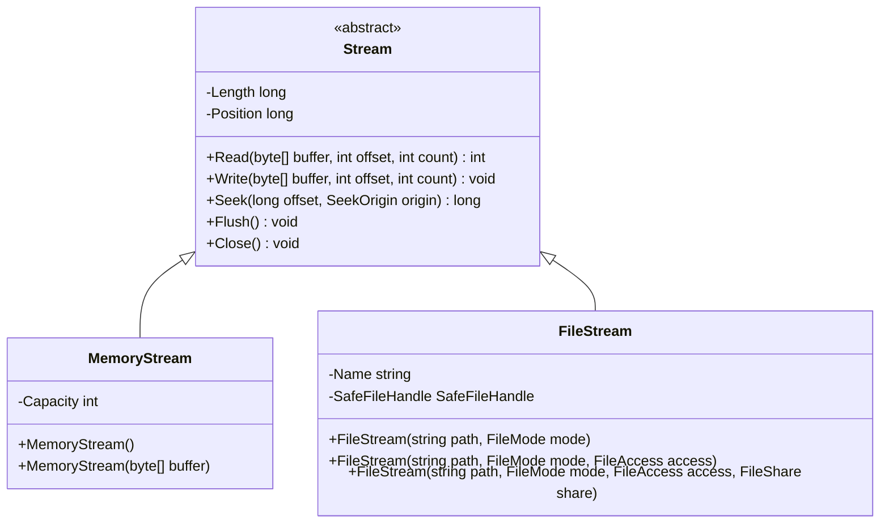

# Mermaid in Markdown
<table><tr><th>Flowchart</th>
<th>Class diagram</th></tr><tr><td>

```mermaid
flowchart LR
  A --> B
  B --> C
  B --> D
```
</td><td>

```mermaid
classDiagram
  A *-- B
  A o-- C
  C "1" o-- "0-*" D
```
</td></td></table>

```mermaid
flowchart
    A(Start) --> B{Budget?}
    B -->|Under $30k| C[Used EV]
    B -->|Between $30k-$50k| D[New Mid-Range EV]
    B -->|Over $50k| E[New Luxury EV]
    
    C --> F{Range Requirement?}
    D --> F
    E --> F
    
    F -->|Under 200 miles| G[City Car]
    F -->|200-300 miles| H[All-Purpose Vehicle]
    F -->|Over 300 miles| I[Long Range Vehicle]
    
    G --> J{Charging at Home?}
    H --> J
    I --> J
    
    J -->|Yes| K[Proceed with Purchase]
    J -->|No| L[Consider Charging Options]
    
    L --> M{Public Charging Available?}
    M -->|Yes| N[Proceed with Purchase]
    M -->|No| O[Reevaluate Requirements]   
```

```mermaid
classDiagram
    class Stream {
        <<abstract>>
        +Read(byte[] buffer, int offset, int count) int
        +Write(byte[] buffer, int offset, int count) void
        +Seek(long offset, SeekOrigin origin) long
        +Flush() void
        +Close() void
        -Length long
        -Position long
    }

    class MemoryStream {
        +MemoryStream()
        +MemoryStream(byte[] buffer)
        -Capacity int
    }

    class FileStream {
        +FileStream(string path, FileMode mode)
        +FileStream(string path, FileMode mode, FileAccess access)
        +FileStream(string path, FileMode mode, FileAccess access, FileShare share)
        -Name string
        -SafeFileHandle SafeFileHandle
    }

    Stream <|-- MemoryStream
    Stream <|-- FileStream
```