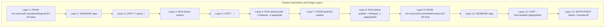

# Docker layers

```mermaid
graph TD
    subgraph "Docker Instructions and Image Layers"
        layer1["Layer 1: FROM mcr.microsoft.com/dotnet/aspnet:8.0 AS base"] --> layer2["Layer 2: WORKDIR /app"]
        layer2 --> layer3["Layer 3: COPY \*.csproj ./"]
        layer3 --> layer4["Layer 4: RUN dotnet restore"]
        layer4 --> layer5["Layer 5: COPY . ./"]
        layer5 --> layer6["Layer 6: RUN dotnet build -c Release -o /app/build"]
        layer6 --> layer7["Layer 7: FROM build AS publish"]
        layer7 --> layer8["Layer 8: RUN dotnet publish -c Release -o /app/publish"]
        layer8 --> layer9["Layer 9: FROM mcr.microsoft.com/dotnet/runtime:8.0 AS final"]
        layer9 --> layer10["Layer 10: WORKDIR /app"]
        layer10 --> layer11["Layer 11: COPY --from=publish /app/publish ."]
        layer11 --> layer12["Layer 12: ENTRYPOINT dotnet, YourApp.dll"]
    end
```