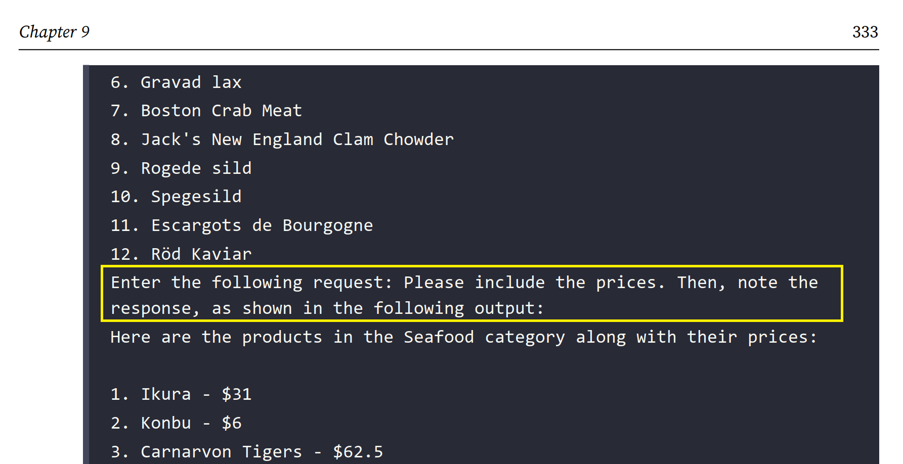
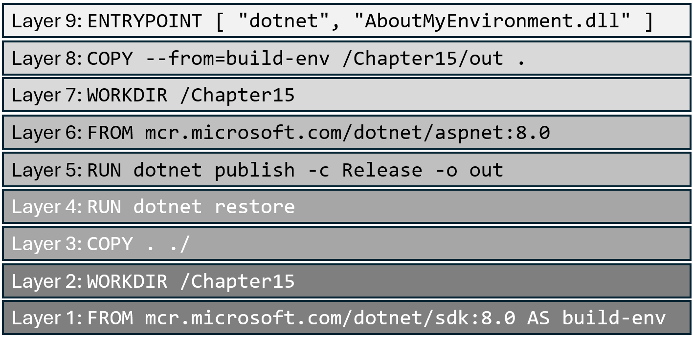

**Errata** (19 items)

If you find any mistakes, then please [raise an issue in this repository](https://github.com/markjprice/tools-skills-net8/issues) or email me at markjprice (at) gmail.com.

- [Breaking change in Aspire 8.2](#breaking-change-in-aspire-82)
- [Renaming "Components" to "Integrations" in Aspire 8.2 and later](#renaming-components-to-integrations-in-aspire-82-and-later)
- [Page 39 - Making the Most of the Tools in Your Code Editor](#page-39---making-the-most-of-the-tools-in-your-code-editor)
- [Page 143 - Creating code with objects to view](#page-143---creating-code-with-objects-to-view)
- [Page 285 - Encrypting symmetrically with AES](#page-285---encrypting-symmetrically-with-aes)
- [Page 305 - Implementing authentication and authorization](#page-305---implementing-authentication-and-authorization)
- [Page 331 - Adding session memory and enabling multiple functions](#page-331---adding-session-memory-and-enabling-multiple-functions)
- [Page 333 - Adding session memory and enabling multiple functions](#page-333---adding-session-memory-and-enabling-multiple-functions)
- [Page 341 - OllamaSharp .NET package](#page-341---ollamasharp-net-package)
- [Page 356 - Registering multiple implementations](#page-356---registering-multiple-implementations)
- [Page 388 - Creating a SUT, Page 401 - Controlling test fixtures](#page-388---creating-a-sut-page-401---controlling-test-fixtures)
- [Page 392 - Test methods with parameters](#page-392---test-methods-with-parameters)
- [Page 406 - Libraries for mocking](#page-406---libraries-for-mocking)
- [Page 415 - Generating fake data with Bogus](#page-415---generating-fake-data-with-bogus)
- [Page 427 - Walkthrough of an example integration test](#page-427---walkthrough-of-an-example-integration-test)
- [Page 509 - Generating tests with the Playwright Inspector](#page-509---generating-tests-with-the-playwright-inspector)
- [Page 536 - Docker image hierarchy and layers](#page-536---docker-image-hierarchy-and-layers)
- [Page 579 - Docker versus Podman for containers](#page-579---docker-versus-podman-for-containers)
- [Page 622 - Builder pattern example](#page-622---builder-pattern-example)

# Breaking change in Aspire 8.2

To use .NET Aspire 8.2, you will need to make sure that you have the latest version of the workload installed as well as make sure that your AppHost project references the latest version of the `Aspire.Hosting.AppHost` package. Otherwise, you may see a build error similar to this:
```
xxx.AppHost is a .NET Aspire AppHost project that needs a package reference to Aspire.Hosting.AppHost version 8.2.0 or above to work correctly.
```

To fix it, make sure that your AppHost project file contains the following package reference:
```xml
<PackageReference Include="Aspire.Hosting.AppHost" Version="8.2.0" />
```

Learn more about this breaking change at the following link: https://github.com/dotnet/aspire/issues/5501.

# Renaming "Components" to "Integrations" in Aspire 8.2 and later

The Aspire team has renamed "Components" to "Integrations" in Aspire 8.2 and later. You can learn more at the following link: https://devblogs.microsoft.com/dotnet/announcing-dotnet-aspire-8-2/.

# Page 39 - Making the Most of the Tools in Your Code Editor

> Thanks to [Giuseppe Guerra](https://github.com/giuseppe-guerra) for raising this [issue on March 25, 2025](https://github.com/markjprice/tools-skills-net8/issues/27).

In the first paragraph I wrote, "interactive development environments (IDEs)", when I should have written, "integrated development environments (IDEs)".

# Page 143 - Creating code with objects to view

> Thanks to [Giuseppe Guerra](https://github.com/giuseppe-guerra) for raising this [issue on March 24, 2025](https://github.com/markjprice/tools-skills-net8/issues/25).

In Step 2, I wrote, "import `System.Convert`, `System.Convert`", but I should have written, "import `System.Console`, `System.Convert`"

# Page 285 - Encrypting symmetrically with AES

> Thanks to [P9avel](https://github.com/P9avel) for raising this [issue on September 26, 2024](https://github.com/markjprice/tools-skills-net8/issues/6).

In Step 7, in the `Decrypt` method, in the `using (MemoryStream ms = new())` code block, I call the `aes.CreateDecryptor()` method twice, as shown in the following code:
```cs
using (MemoryStream ms = new())
{
  using (ICryptoTransform transformer = aes.CreateDecryptor())
  {
    using (CryptoStream cs = new(
      ms, aes.CreateDecryptor(), CryptoStreamMode.Write))
    {
...
```

The second call should be a reference to the `transformer` variable, as shown in the following code:
```cs
using (MemoryStream ms = new())
{
  using (ICryptoTransform transformer = aes.CreateDecryptor())
  {
    using (CryptoStream cs = new(
      ms, transformer, CryptoStreamMode.Write))
    {
...
```

# Page 305 - Implementing authentication and authorization

> Thanks to [OpticOrange](https://github.com/OpticOrange) for raising this [issue on February 9, 2025](https://github.com/markjprice/tools-skills-net8/issues/23).

In Step 11, I wrote `Pa$$word` instead of `Pa$$w0rd`. I made the same mistake in Step 13, and on page 306 in Step 4 and Step 5. 

# Page 331 - Adding session memory and enabling multiple functions

> Thanks to [lenara122](https://github.com/lenara122) for raising this [issue on February 18, 2025](https://github.com/markjprice/tools-skills-net8/issues/24).

On page 319, the configuration uses Semantic Kernel package version `1.13.0` which was the current version when writing the book. If you use the latest version available in February 2025, version `1.37.0`, then there are some changes needed to migrate to the newer version, as described at the following link: https://learn.microsoft.com/en-us/semantic-kernel/support/migration/function-calling-migration-guide?pivots=programming-language-csharp.

In Step 2, the statement to set the options, as shown in the following code:
```cs
OpenAIPromptExecutionSettings options = new()
  { ToolCallBehavior = ToolCallBehavior.AutoInvokeKernelFunctions };
```

Should be updated to the following code:
```cs
PromptExecutionSettings options = new()
  { FunctionChoiceBehavior = FunctionChoiceBehavior.Auto() };
```

# Page 333 - Adding session memory and enabling multiple functions

> Thanks to [Giuseppe Guerra](https://github.com/giuseppe-guerra) for raising this [issue on March 24, 2025](https://github.com/markjprice/tools-skills-net8/issues/26).

After Step 7, I show the output from entering the question, but in the middle of the output, the text highlighted in yellow should be a separate Step 8, as shown in the following figure:



# Page 341 - OllamaSharp .NET package

> Thanks to [P9avel](https://github.com/P9avel) for raising this [issue on September 29, 2024](https://github.com/markjprice/tools-skills-net8/issues/8).

In Step 2, I wrote, "add references to packages for Spectre Console and Ollama" when I should have written, "add references to packages for Spectre Console and OllamaSharp". 

# Page 356 - Registering multiple implementations

> Thanks to [P9avel](https://github.com/P9avel) for raising this [issue on October 2, 2024](https://github.com/markjprice/tools-skills-net8/issues/10).

In the first statement of the code block, I mis-cased the method name as `AddKeyedsingleton`. It should be `AddKeyedSingleton`.

# Page 388 - Creating a SUT, Page 401 - Controlling test fixtures

> Thanks to [P9avel](https://github.com/P9avel) for raising this [issue on October 2, 2024](https://github.com/markjprice/tools-skills-net8/issues/11).

In Step 2 on both pages 388 and 401, I wrote, "treat errors as errors", when I should have written "treat warnings as errors".

# Page 392 - Test methods with parameters

> Thanks to [P9avel](https://github.com/P9avel) for raising this [issue on October 2, 2024](https://github.com/markjprice/tools-skills-net8/issues/13).

In the third bullet I wrote, "Decorate the test method with `[ClassData]` and reference a method that represents an `IEnumerable` of arrays of types."

I should have written, "Decorate the test method with `[ClassData]` and reference a class that derives from `TheoryData<T1, T2, ...>` and call the inherited `Add` method in its constructor to add sets of expected parameter and return values."

# Page 406 - Libraries for mocking

In the warning box, I wrote, "You can read the release notes at the following link:
https://github.com/devlooped/moq/blob/main/CHANGELOG.md#4200-2023-08-07." But this link is now broken. 

In the next edition, I will replace that sentence with the following, "You can read the pull request at the following link:https://github.com/devlooped/moq/pull/1363."

# Page 415 - Generating fake data with Bogus

> Thanks to [P9avel](https://github.com/P9avel) for raising this [issue on October 3, 2024](https://github.com/markjprice/tools-skills-net8/issues/14).

In *Table 11.7*, `f.Finance.Currency().Code` should be `Finance.Currency().Code`. I don't know how the extra `f.` got there! 

# Page 427 - Walkthrough of an example integration test

> Thanks to [P9avel](https://github.com/P9avel) for raising this [issue on October 7, 2024](https://github.com/markjprice/tools-skills-net8/issues/15).

I wrote, "The preceding code is a unit test class named `GetById` ..." when I should have written, "The preceding code is an integration test class named `GetById` ..."

# Page 509 - Generating tests with the Playwright Inspector

> Thanks to [P9avel](https://github.com/P9avel) for raising this [issue on October 9, 2024](https://github.com/markjprice/tools-skills-net8/issues/16).

In the paths to "start the Playwright Inspector with emulation options like setting a view port size", I typed a slash `/` instead of a dot `.` between the `8` and `0`. For example, I typed `net8/0` instead of `net8.0`. 

# Page 536 - Docker image hierarchy and layers

> Thanks to [P9avel](https://github.com/P9avel) for raising this [issue on October 11, 2024](https://github.com/markjprice/tools-skills-net8/issues/18).

*Figure 15.7* has multiple mistakes, like Layer 2 had an erroneous `FROM` before `WORKDIR`, so I have created a fixed image here:


I have also made the figure example match the actual `Dockerfile` that you will create on page 542 in Step 4, as shown in the following code:
```Dockerfile
FROM mcr.microsoft.com/dotnet/sdk:8.0 AS build-env
WORKDIR /Chapter15
# Copy everything
COPY . ./
# Restore as distinct layers
RUN dotnet restore
# Build and publish a release
RUN dotnet publish -c Release -o out
# Build runtime image
FROM mcr.microsoft.com/dotnet/runtime:8.0
WORKDIR /Chapter15
COPY --from=build-env /Chapter15/out .
ENTRYPOINT ["dotnet", "AboutMyEnvironment.dll"]
```

# Page 579 - Docker versus Podman for containers

> Thanks to [P9avel](https://github.com/P9avel) for raising this [issue on October 14, 2024](https://github.com/markjprice/tools-skills-net8/issues/20).

**Podman pro** should be **Podman pros**.

# Page 622 - Builder pattern example

> Thanks to [P9avel](https://github.com/P9avel) for raising this [issue on October 15, 2024](https://github.com/markjprice/tools-skills-net8/issues/21).

I wrote, "First, you create the Builder Interface, with methods to set each of the product’s properties, and a
`Build` method to return the constructed product, as shown in the following code:"

Both instances of the word "product" should be "Product" because in the context of the Builder pattern, it refers to the term that means the object being built. In the next edition I will fix this. 
