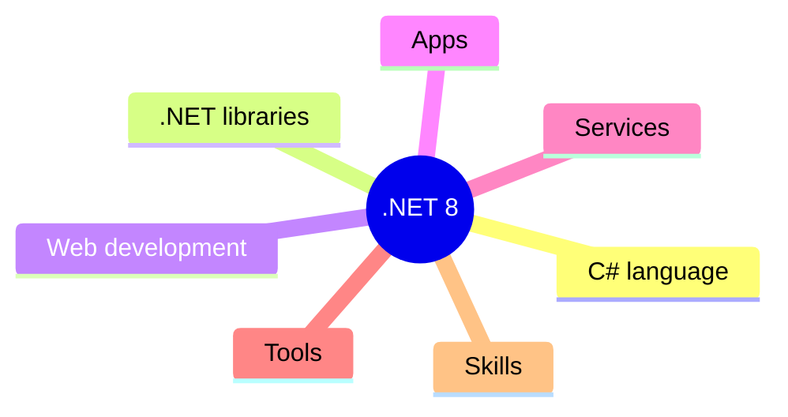
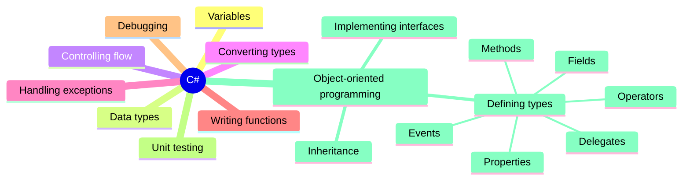
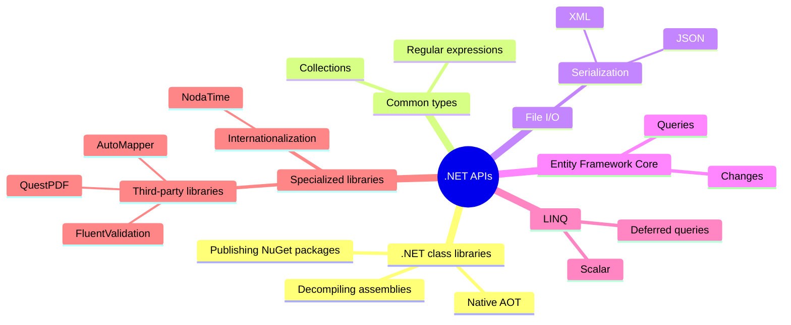
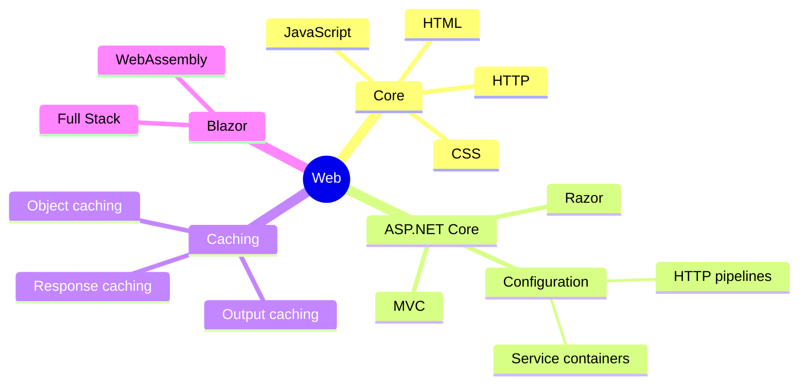
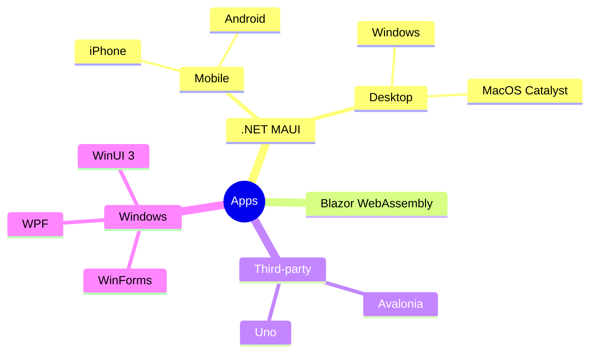
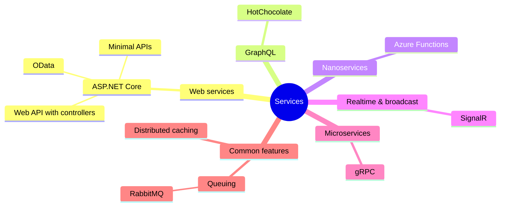
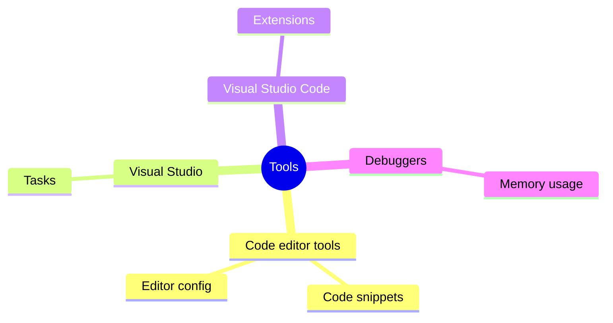
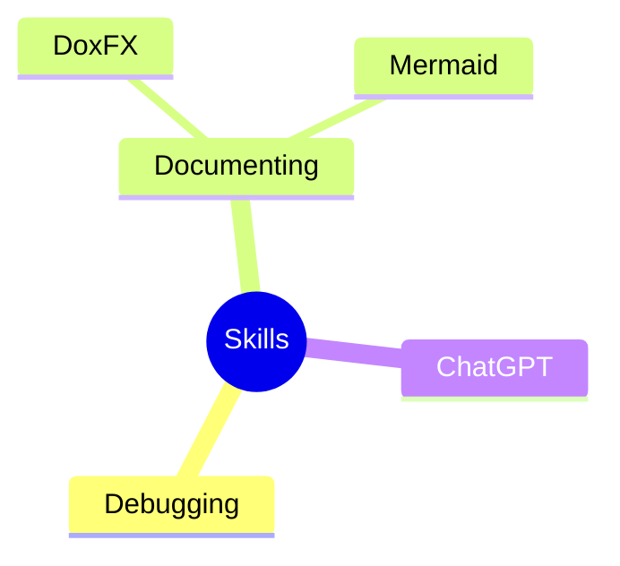
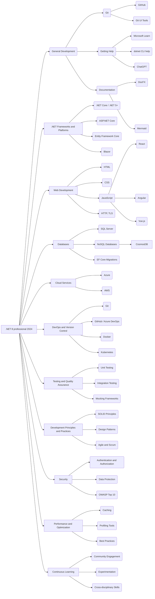
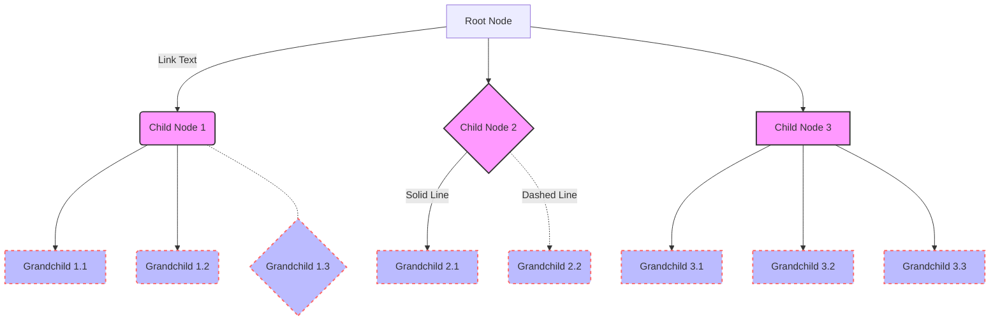

# What does a modern C# and .NET 8 developer need to know?

## .NET 8 overview

## C# language detail

## .NET libraries detail

## Web development detail

## Apps detail

## Services detail

## Tools detail

## Skills detail

## Graph used for a "mind map"

## Graph showing variety of elements and custom styling

