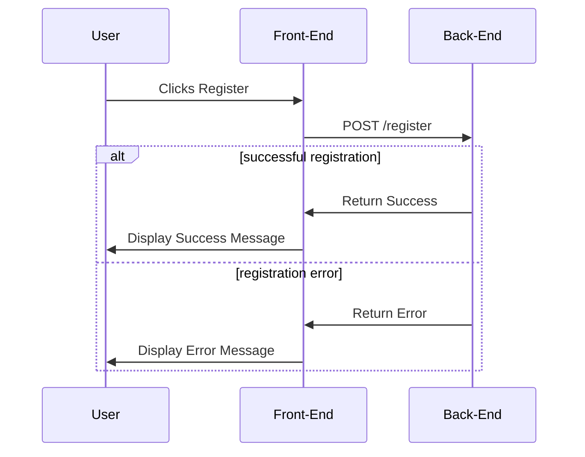
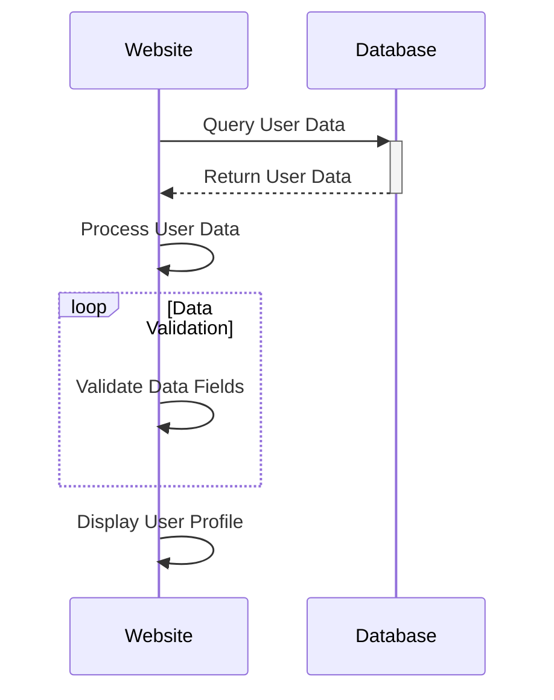

# Sequence diagram for a user registration process

```mermaid
sequenceDiagram
  participant U as User
  participant F as Front-End
  participant B as Back-End
  U->>F: Clicks Register
  F->>B: POST /register
  alt successful registration
    B->>F: Return Success
    F->>U: Display Success Message
  else registration error
    B->>F: Return Error
    F->>U: Display Error Message
  end
```

# Sequence diagram for website querying data

```mermaid
sequenceDiagram
  participant W as Website
  participant D as Database
  W->>+D: Query User Data
  D-->>-W: Return User Data
  W->>W: Process User Data
  loop Data Validation
    W->>W: Validate Data Fields
  end
  W->>W: Display User Profile
```
