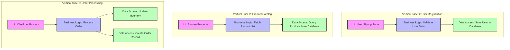

# Vertical Slice architecture

```mermaid
graph TD
    subgraph "Vertical Slice 1: User Registration"
        UI1[UI: User Signup Form] --> BL1[Business Logic: Validate User Data]
        BL1 --> DA1[Data Access: Save User to Database]
    end

    subgraph "Vertical Slice 2: Product Catalog"
        UI2[UI: Browse Products] --> BL2[Business Logic: Fetch Product List]
        BL2 --> DA2[Data Access: Query Products from Database]
    end

    subgraph "Vertical Slice 3: Order Processing"
        UI3[UI: Checkout Process] --> BL3[Business Logic: Process Order]
        BL3 --> DA3[Data Access: Update Inventory]
        BL3 --> DA4[Data Access: Create Order Record]
    end

    style UI1 fill:#f9f,stroke:#333,stroke-width:2px
    style UI2 fill:#f9f,stroke:#333,stroke-width:2px
    style UI3 fill:#f9f,stroke:#333,stroke-width:2px
    style BL1 fill:#bbf,stroke:#333,stroke-width:2px
    style BL2 fill:#bbf,stroke:#333,stroke-width:2px
    style BL3 fill:#bbf,stroke:#333,stroke-width:2px
    style DA1 fill:#bfb,stroke:#333,stroke-width:2px
    style DA2 fill:#bfb,stroke:#333,stroke-width:2px
    style DA3 fill:#bfb,stroke:#333,stroke-width:2px
    style DA4 fill:#bfb,stroke:#333,stroke-width:2px
```
